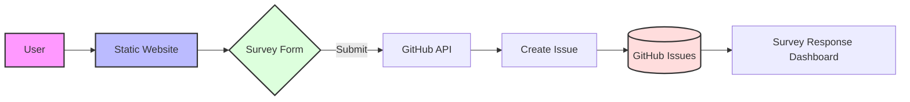

# GitHub Workshop Survey

A feedback collection system for the GitHub Workshop using GitHub Issues as a backend storage solution.

## Architecture



## Features

- Static website hosted on GitHub Pages
- Survey responses stored as GitHub Issues
- Secure token-based authentication
- Real-time character count for feedback
- Mobile-responsive design
- GitHub-themed UI

## Setup

1. Clone the repository:
```bash
git clone https://github.com/dhanachavan/survey-collector.git
cd survey-collector
```

2. Create a `config.js` file:
```javascript
const GITHUB_CONFIG = {
    token: 'YOUR_GITHUB_TOKEN',
    owner: 'YOUR_USERNAME',
    repo: 'YOUR_REPO_NAME'
};
```

3. Deploy to GitHub Pages:
```bash
git add .
git commit -m "Initial commit"
git push origin main
```

## Data Flow

1. User fills out the survey form
2. Client-side validation ensures required fields
3. Form submission creates a new GitHub Issue
4. Response stored with formatted markdown
5. Issues available in repository for analysis

## Security

- GitHub Personal Access Token (PAT) stored locally
- config.js excluded from git repository
- CORS headers for API requests
- Rate limiting on GitHub API

## Development

- HTML5 for structure
- CSS3 for styling
- Vanilla JavaScript for functionality
- GitHub REST API for storage

## Contributing

1. Fork the repository
2. Create your feature branch
3. Commit your changes
4. Push to the branch
5. Create a Pull Request

## License

MIT License - See LICENSE file for details